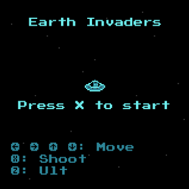
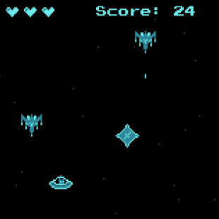

# Earth Invaders

  

Inspired by the classic *Space Invaders*, except this time, Earth is the enemy. Destroy incoming ships, dodge bullets, and use your ultimate ability to obliterate everything.

Fast reflexes and smart timing are your best weapons. **Good luck, defender!**


## :space_invader: How to Play

- If an enemy bullet hits you, you **lose** a life.
- If an enemy reaches the bottom of the screen, you **lose** a life.
- You have **3 lives**. Lose all of them, and it's **game over**.
- Defeating an enemy increases your score by 1.
- Difficulty increases as you survive, up to a max at score 100.


## :video_game: Controls

|   Button   |     Action     |
| ---------- |:--------------:|
| Arrow Keys | Move Spaceship |
| X          | Shoot          |
| Z          | Ultimate       |


## :wrench: Building
Build the cart by running:

```shell
make
```

Then run it with:

```shell
w4 run build/cart.wasm
```

For more info about setting up WASM-4, see the [quickstart guide](https://wasm4.org/docs/getting-started/setup?code-lang=c#quickstart).


## :information_source: About this Project

This game was developed for the [WASM-4](https://wasm4.org) fantasy console as part of an assignment at the *State University of Maringá (UEM)*, under the guidance of Professor Marcelo G. Malheiros.  

All code and assets were created from scratch for learning purposes.

- [Documentation](https://wasm4.org/docs): Learn more about WASM-4.
